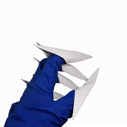

# DOOM sprite tools


Turn camera footage into game sprites like weapons.<br>
Chroma key filter is used to extract opaque pixels.<br>
Requires **ffmpeg** to be installed.<br>

## Usage
* photos2sprites.py
```
python photos2sprites.py \
	"examples/photos/*.jpg" \
	--color "2b6426" \
	--similarity 0.05 \
	--crop "2000:2000:500:0" \
	--scale "256:256" \
	--gamma_g 0.95 \
	--output "test-photos"
```

* video2sprites.py
```
python video2sprites.py \
	"examples/video.mp4" \
	--seek 2.0 \
	--duration 4.0 \
	--fps 2.0 \
	--color "2b6426" \
	--similarity 0.05 \
	--crop "1080:1080:250:0" \
	--scale "256:256" \
	--gamma_g 0.95 \
	--output "test-video"
```

* sprites2webp.py
```
python sprites2webp.py \
	"test-photos" \
	--fps 5.0
```
